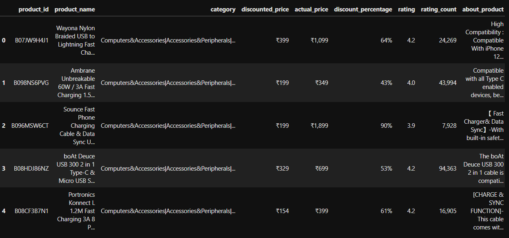
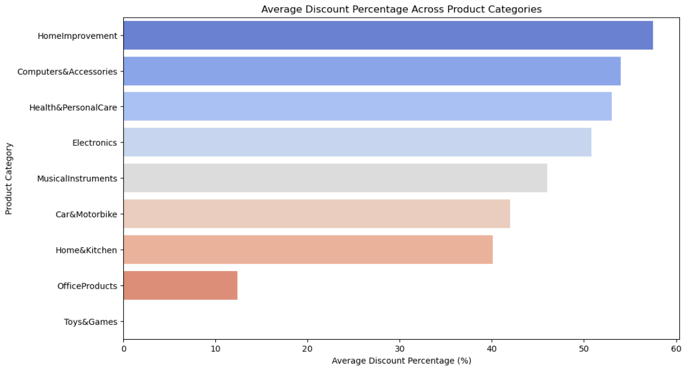
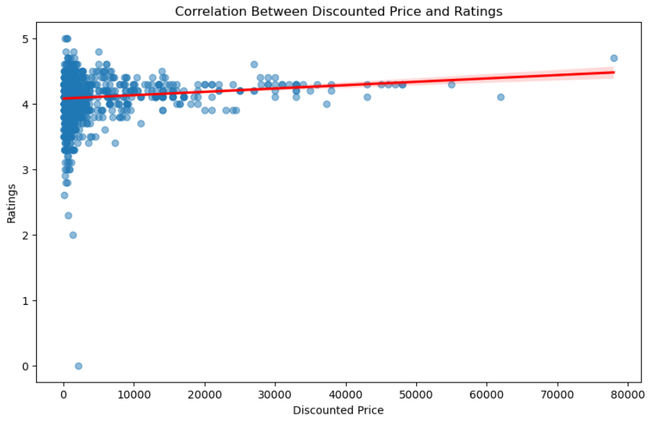
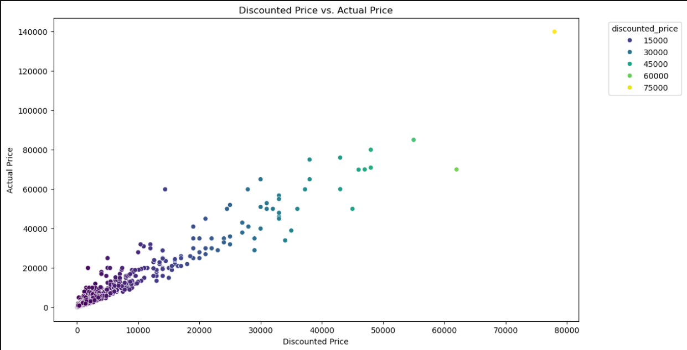
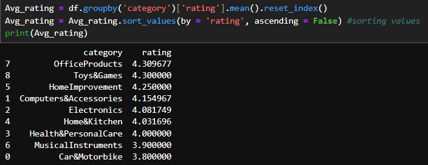
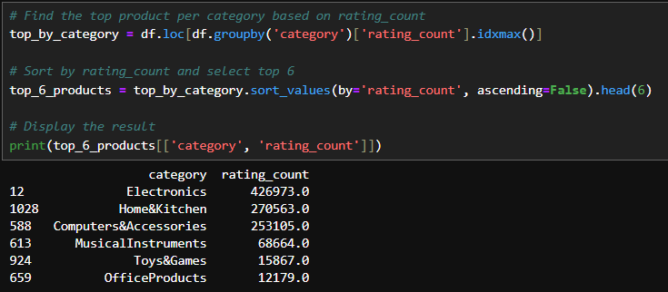
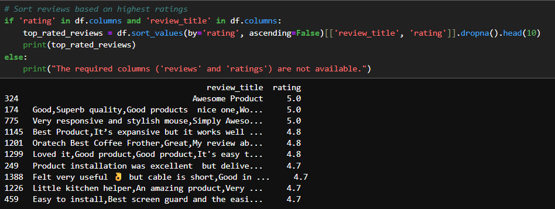

# Amazon Sales Exploratory Data Analysis (EDA)


## 📌 Overview
Exploratory Data Analysis of Amazon sales data to uncover business insights, trends, and customer behavior patterns.

## 📁 Dataset
This dataset contains information on 1K+ Amazon products, including their ratings, reviews, and other details.

### Features:

- `product_id`: Unique identifier for each product
- `product_name`: Name of the product
- `category`: Category of the product
- `discounted_price`: Discounted price of the product
- `actual_price`: Actual price of the product
- `discount_percentage`: Percentage of discount for the product
- `rating`: Rating of the product (1-5)
- `rating_count`: Number of people who voted for the Amazon rating
- `about_product`: Description about the product
- `user_id`: ID of the user who wrote the review
- `user_name`: Name of the user who wrote the review
- `review_id`: ID of the user review
- `review_title`: Short review
- `review_content`: Long review
- `img_link`: Image link of the product
- `product_link`: Official website link of the product



---

## 🛠️ Tech Stack
- Python (Pandas, NumPy)
- Visualization (Matplotlib, Seaborn)
- Jupyter Notebook

---

## 📊 Key Analysis
1. Sales trends over time
2. Category-wise performance
3. Customer segmentation
4. Geographic analysis
5. Payment method preferences

<div align="center">
  
  
  
</div>
<div align="center">
  
  
  
</div>

---

## � How to Run
```bash
git clone https://github.com/jaytamkhane/Amazon-Sales-EDA.git
pip install -r requirements.txt
jupyter notebook Amazon_Sales_EDA.ipynb
```

---
### 📬 **Contact**

If you have any questions or would like to collaborate, feel free to reach out to me:

- LinkedIn Profile - https://www.linkedin.com/in/jay-tamkhane

- Gmail : jaytamkhane161@gmail.com
---

Thank you for checking out the project! 😊

---

